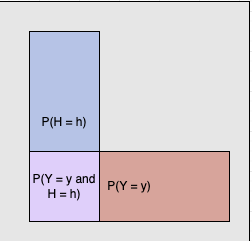

# 2 - Probability: Univariate Models

## What is Probability?

Two interpretations: *frequentist* and *Bayesian*

**Frequentist**: views probabilities as describing expected frequencies events that are repeated infinitey - eg. a coin having P(heads) implies that as the number of coin flips $\rightarrow \infty$, the observed proportion of heads approaches .5

**Bayesian**: focuses on quantifying *uncertainty* about the outcome of events, rather than their aggregate outcomes over many trials. Useful framework for thinking about events that don't have many repeated trials

## Random Variables

An unknown quantity with an associated set of possible events, or *sample space*, over which we can assign probabilities.

Two basic types: 

1. *Discrete* - ex. coin flips. We model its probability *mass* function: $Pr(X = x)$
2. Continuous - ex. height. Model the probability *density* function: also $Pr(X = x)$, although this really has no meaning for a cont. dist., so we have to use the CDF to describe the probability of continuous values falling in certain *ranges*

Cumulative Distribution Function (CDF) - represented by:

$$
Pr(X \leq x) 
$$

with the property

$$
P(a \leq X \leq b) = P(X \leq b) - P(X \leq a) = P(a) - P(b)
$$

## Summary Statistics and Their Limitations

Mean ($\mu$): $\mathbb{E}[X] \equiv \int_{X}{xp(x)}$

Variance ($\sigma^2$): $V(X) = \mathbb{E}[X^2] - \mu^2$

Standard Deviation ($\sigma$): $\sqrt{V(X)}$

The **Datasaurus dozen** and why summary statistics are not a replacement for proper data visualization:

The above plots are a famous example of the limitations of summary statistics; all of the bivariate datasets shown have the same mean and variance for both the x and y variables, yet obviously look completely different.

## Bayes' Theorem

The basis for much of modern statistics, namely *bayesian inference*, where one attempts to model events in a way that quantifies uncertainty.

$$
P(H = h \mid Y = y) = \frac{P(H = h) \cdot P(Y = y \mid H = h)}{P(Y = y)}
$$

The basic idea: we have some *hidden quantity* (H) which we wish to model using *observed data* (P). We have some initial expectation for H (namely $P(H = h)$, also called the *prior*), which we wish to **update** using our new knowledge about Y and its relationship to H ($P(Y = y \mid H = h)$, or the *likelihood*).

The outcome, called the **posterior distribution** or $P(H = h \mid Y = y)$, represents our updated belief about H.

This can also be represented as:

$$
P(H = h \mid Y = y) = \frac{P(Y = y \cap H = h)}{P(Y = y)}
$$

We can visualize this as:

Where we want the proportion of the red rectangle which is jointly occupied by the blue rectangle (the purple square).

## Important Univariate Distributions

**Discrete**

- Binomial - two outcomes (each with fixed probabilities), can take place over many trials

- Bernoulli - binomial with one trial

**Continuous**

- Laplace - double sided exponential. PDF looks like a gaussian with absolute value instead of square

- Gaussian - most widely used distribution. Central limit theorem tells us that the mean of an infinite sum of iid random variables approximates a gaussian

- Student t - gaussian with extra degrees of freedom parameter. More robust to outliers. 

## Summary 

- 2 main interpretations of probability: frequentist and bayesian
- random variables represent unknown continuous or discrete quantities to which probability distributions can be assigned
- bayes' theorem is crucial to statistics, and informs how we quantify uncertainty
- summary statistics have severe limitations and should not be relied on completely - it is important to visually inspect data
