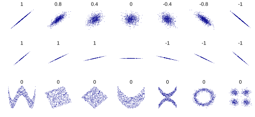
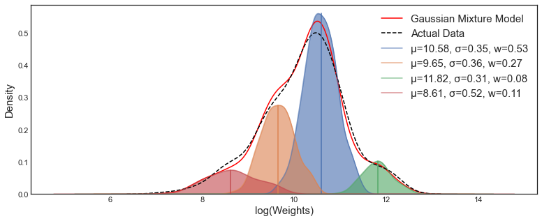
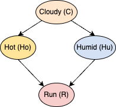

# 3 - Probability: Multivariate Models

## Covariance, Correlation, Independence, and Causation

The **covariance**, which measures the degree to which two random variables are linearly related, is defined as:

$$
\text{Cov}[X, Y] \equiv \mathbb{E}[XY] - \mathbb{E}[X]\mathbb{E}[Y]
$$

This is not to be confused with the **correlation** (namely the pearson correlation coefficient), which is instead restricted to the range $[-1, 1]$ and is defined as:

$$
\rho \equiv \frac{\text{Cov}[X, Y]}{\sqrt{V[X]V[Y]}}
$$

Covariance and correlation measure the *strength* of a linear relationship, although they say nothing about the *direction* other than whether it is positive or negative.

**Independence**: two variables may be uncorrelated, but still not be independent. By contrast, if they are independent, then they will be uncorrelated. 

**Correlation vs. Causation**: two variables might be correlated, but this says nothing about whether one causes the other.

**Simpson's Paradox** describes how trends present in subsets of data may disappear or reverse when analyzed over the full dataset.

Importantly, two variables may not be *linearly* correlated: $\rho \approx 0$, but still have a meaningful nonlinear relationship. Consider the following datasets:

This highlights the importance of actually looking at your data. Additionally, it implies that $r^2$ is a poor measure of a nonlinear ML model's performance.

## Multivariate Gaussian

The multivariate gaussian or multivariate normal (MVN) is a high-dimensional generalization of the stanard 1-D gaussian. 

It is defined as:

$$
N(y \mid \mu, \Sigma) = \frac{1}{(2\pi)^{D/2}|\Sigma|^{1/2}}\exp{[-\frac{1}{2}(y - \mu)^T\Sigma^{-1}(y - \mu)]}
$$

Where $y$ and $\mu$ are vectors in $\mathbb{R}^D$, and $\Sigma$ is a $D \; \text{x} \; D$ covariance matrix. 

Despite the fancy linear algebra, this can be seen to be very similar to the standard 1-D gaussian pdf, with the major differences being the inverse of $\Sigma$ as a replacement for $\frac{1}{\sigma}$, as well as the extra D term to ensure the pdf integrates to 1 for higher dimensions.

## Mixture Models

Rather than attempt to argue for a specialized, non-standard probability distribution for a dataset with an unusual shape, one can instead use a linear combination of classical probability models to create a **mixture model**, which is defined as:

$$
p(y \mid \theta) = \sum_{i=1}^{n}{\pi_i \cdot p_i(y)} 
$$

$$
s.t. \sum{\pi_i} = 1 \\
\text{and} \\
0 \leq \pi_i \leq 1 \; \forall \; i 
$$

Where each $p_i$ is a simple probability model with and associated weight $\pi_i$, and $p$ is a mixture model composed of $n$ total simple distributions.

An example mixture of 4 gaussians ('w' are the weights):

## Probabilistic Graphical Models

We can represent an extended network of conditional probabilities as a *directed acyclic graph (DAG)* called a **probabilistic graphical model (PGM)**. 

For example, say I wanted to represent the probability that I will go on a run (R) given the probability it will be cloudy (C), hot (Ho), and humid (Hu). Clearly, whether or not it is cloudy will influence whether it is hot or humid, which will impact my decision.

I won't fill out all the conditional probabilities, but let's say that P(C) = .4, P(!C) = .6, P(Ho | C) = .3, P(Ho | !C) = .7, P(R | Ho and Hu) = .1, etc. 

We could imagine computing the joint probability that I go on a run given the individual conditional probabilities described by this network.

## Summary
- linear relationships between two variables can be described by covariance and correlation
- the multivariate gaussian is just a D-dimensional generalization of the gaussian
- mixture models attempt to model complex distributions using linear combinations of simple distributions
- PGMs lay out a network of conditional probabilities that can be used to calculate joint probabilities
