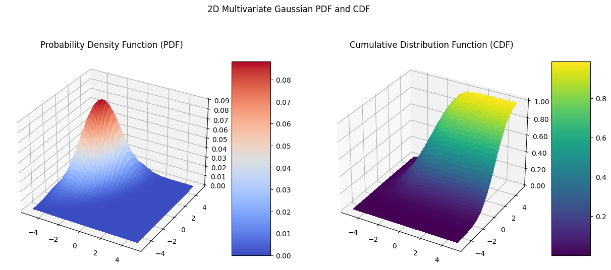

# Notes - *Probabilistic Machine Learning* by Kevin P. Murphy

This repo contains my ongoing notes, exercise solutions, from-scratch implementations, and other related material for *Probabilistic Machine Learning: An Introduction* by Kevin P. Murphy.

- [find a pdf here](https://probml.github.io/pml-book/book1.html)
- [buy a copy here](https://www.amazon.com/Probabilistic-Machine-Learning-Introduction-Computation/dp/0262046822)

## Contents

**Chapter Notes**
- [Chapter 1 - Introduction](Chapter_1/ch_1_notes.md)
- [Chapter 2 - Probability: Univariate Models](Chapter_2/ch_2_notes.md)
- [Chapter 3 - Probability: Multivariate Models](Chapter_3/ch_3_notes.md)
- [Chapter 4 - Statistics](Chapter_4/ch_4_notes.md)

**From-Scratch Implementations**
- [Chapter 2 - Softmax with Log-sum-exp trick](Chapter_2/softmax.ipynb)
- [Chapter 3 - Multivariate Gaussian + Monte Carlo Integration](Chapter_3/multivariate_gaussian.ipynb)
- [Chapter 4 - Exponentially Weighted Moving Average](Chapter_4/exponentially_weighted_moving_average.ipynb)
- [Chapter 5 - Precision-Recall Curve](Chapter_5/precision_recall_curve.ipynb)

## Some highlights and neat plots:

**From-Scratch Multivariate Gaussian**

This one was fun. Ended up learning how to do monte carlo integration in order to evaluate the cdf.



## To build my python environment

The python environment for this project is managed with uv. If you don't have uv installed, [view the instructions for installing uv.](https://docs.astral.sh/uv/getting-started/installation/)

Once uv is installed, build a suitable environment with:

```bash
uv sync
```
